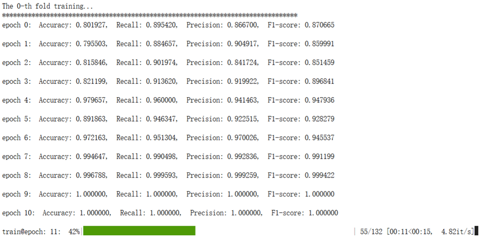
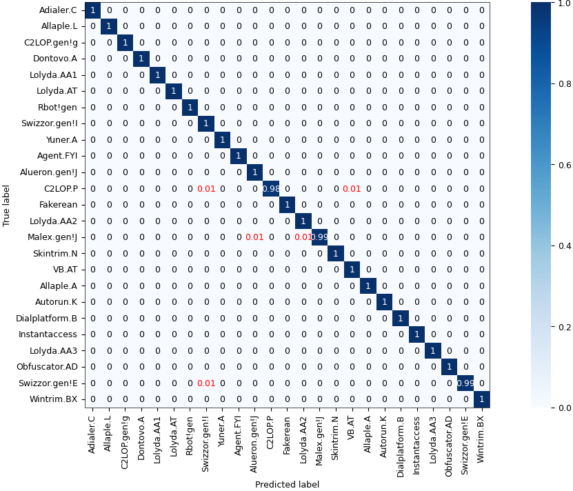
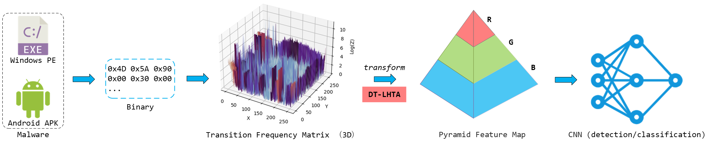

# PyraMal: Byte-level Malware Detection and Classification via Pyramid Feature Map

**PyraMal** is a novel, platform-agnostic malware detection and classification framework that leverages **raw binary bytes** of executable files (e.g., APK, PE) to construct **pyramid-structured feature maps**, enabling high-accuracy, robust, and generalizable malware analysis without relying on parsing internal structures (e.g., AndroidManifest.xml, API calls, or dex files).

> 📌 **Key Advantages**
>
> - Works directly on raw binary data — no parsing required
> - Strong cross-dataset generalization
> - Achieves **99.94% accuracy** on the MalImg dataset and **99.60% accuracy** on the BIG-2015 dataset
> - Compatible with Android APK and Windows PE formats

---


## 📊 Performance Highlights

| Dataset            | Task                       | Quantity          | Accuracy   | Recall     | Precision  | F1-Score   |
| ------------------ | -------------------------- | ----------------- | ---------- | ---------- | ---------- | ---------- |
| CICAndMal2017Det   | Detection, Android APK     | 2,074             | 94.84%     | 91.17%     | 92.84%     | 91.91%     |
| CICMalDroid2020Det | Detection, Android APK     | 17,242            | 98.48%     | 98.05%     | 97.74%     | 97.89%     |
| **Malimg**         | Classification, Windows PE | 9,339             | **99.94%** | **99.85%** | **99.89%** | **99.87%** |
| **BIG-2015**       | Classification, Windows PE | 10,868            | **99.60%** | **99.57%** | **99.55%** | **99.56%** |
| CICMalDroid2020Cls | Classification Android APK | 13,202            | 95.79%     | 94.79%     | 94.64%     | 94.69%     |
| MOTIF-TOP50        | Classification, Windows PE | top50 from 3,095  | 85.22%     | 83.99      | 84.92%     | 82.64%     |
| MOTIF-TOP100       | Classification, Windows PE | top100 from 3,095 | 80.94%     | 78.89%     | 76.73%     | 75.99%     |

*(See paper for full results and confusion matrices)*


## 🛠️ Installation

### 📃 Prerequisites

- Python ≥ 3.8
- PyTorch (with CUDA support, if available)
- TorchVision, TorchMetrics
- NumPy, Pandas, Pillow , scikit-learn, tqdm


### 📦 Setup

Clone Repository:

```
git clone https://github.com/Wanhu-Nie/pyramal.git
cd pyramal
pip install -r requirements.txt
```


## 🚀 Quick Start

### 1. Prepare Dataset

Run `makrifle.py` to convert binary files into RGB images for CNN-based image recognition. You need to provide the binary file directory and the output image path.

> 💡 Supported formats: `.apk`, `.exe`, `.dll`, or any raw binary file.


### 2. Train / Evaluate the Model

Run `pyramal.py` and specify the relevant parameters for model training (such as dataset, number of cross-validation folds, epochs, batch size, learning rate, etc.) to perform model training and evaluation. The default example uses the Malimg dataset, employs 10-fold cross-validation, and sets a fixed random seed (seed=42) for the training and evaluation process. The training process is illustrated in Figure X, where the performance of the model is validated against the test set and reported after each epoch.




In the paper, the high-resolution confusion matrix of PyraMal on the Malimg dataset is shown below: 




## 🧠 Method Overview

PyraMal is a malware visualization framework featuring a pyramid-structured feature distribution. It treats raw binary bytes as a Markov chain, computes the State Transition Frequency Matrix (STFM), and applies the DT-LHTA algorithm to construct RGB images for malware detection and classification. By operating directly on binary bytes, PyraMal achieves strong cross-platform compatibility, thereby avoiding:

- Parsing failures in obfuscated/malformed samples
- Dependency on volatile features (e.g., API calls, permissions)
- Image distortion from fixed-size resizing




## 📁 Project Structure

```
pyramal/
├── makefile.py                 # Converts raw binary files into RGB images using STFM and DT-LHTA
├── pyramal.py                  # Training and evaluation script for the PyraMal model
├── datasets/                   # Dataset metadata: lists of sample filenames and their labels
│   └── malimg.csv
|	...
├── results/                    # Stores evaluation outputs
├── requirements.txt            # Python dependencies
├── LICENSE                     # Open-source license (MIT)
└── README.md                   # Project overview and quick start guide
```


## 📄 License

This project is licensed under the **MIT License** — see LICENSE for details.

